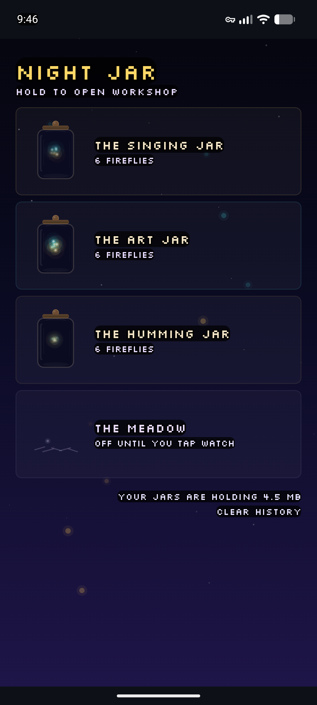
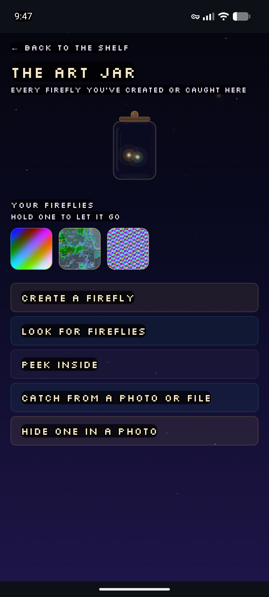
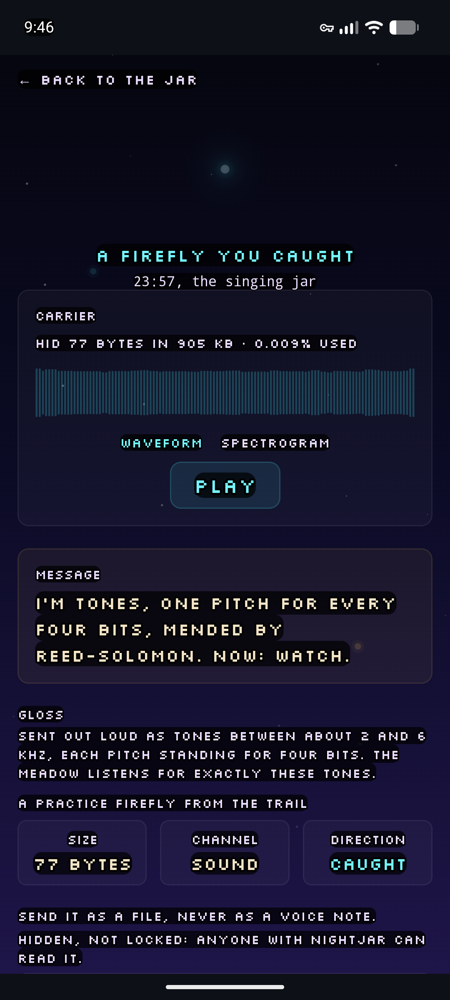
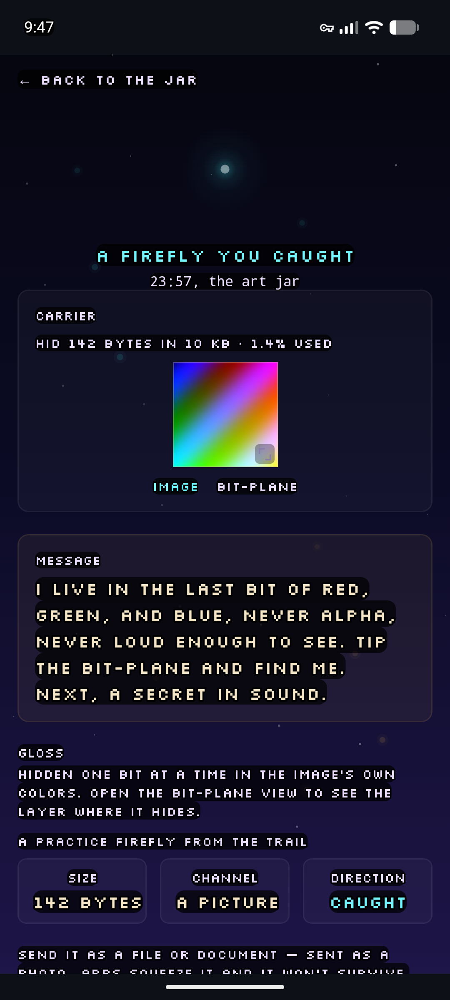
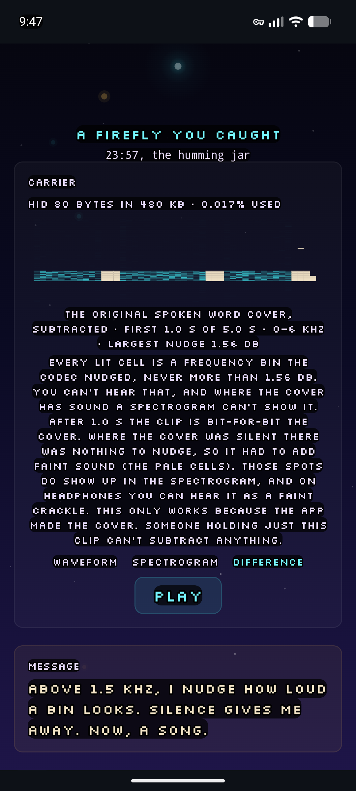
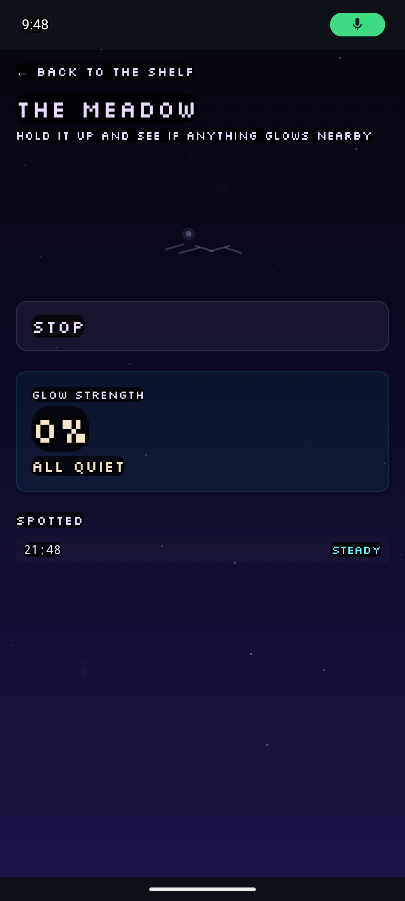
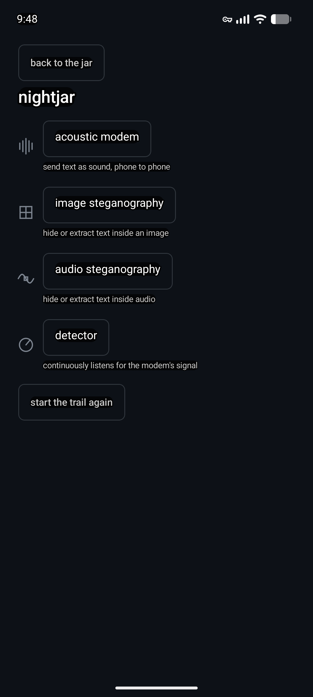

# nightjar

An offline Android app that demonstrates covert data transmission — hiding
data in sound and images — alongside the detection techniques that can catch
it.

## What it does

nightjar pairs four data-hiding techniques with their detection/steganalysis
counterparts, all running locally on-device:

- **Acoustic data-over-sound modem** — sends data phone-to-phone, speaker to
  microphone, room-local, using FSK/PSK/MFSK encoding.
- **Image steganography** — least-significant-bit (LSB) encoding of data
  inside images, plus a steganalysis screen for detecting it.
- **Audio steganography** — four techniques (phase inversion, spectrogram-LSB,
  MFSK, and true phase-coding) for hiding data inside an audio clip.
- **Passive acoustic detector** — a real-time listener that can flag the
  modem's own signal, demonstrating that "covert" acoustic channels aren't
  necessarily undetectable.

The default UI is "Firefly Jar," a disguise-themed front end where every
decoded payload appears as a firefly. The underlying technical module screens
(modem, image stego, audio stego, detector) are reachable via a long-press
reveal gesture from the jar screen.

## Screenshots

Real screenshots from a Pixel 6a. The app opens as **Firefly Jar** — a calm,
disguise-themed front end where every hidden payload shows up as a "firefly."
A long-press on the jar reveals the technical **Workshop** underneath.

<table>
  <tr>
    <td align="center" width="33%">
      <br>
      <sub><b>Firefly Jar</b><br>the disguise home shelf</sub>
    </td>
    <td align="center" width="33%">
      <br>
      <sub><b>Inside a jar</b><br>your fireflies, and the actions</sub>
    </td>
    <td align="center" width="33%">
      <br>
      <sub><b>Hidden in sound</b><br>acoustic data-over-sound modem</sub>
    </td>
  </tr>
  <tr>
    <td align="center">
      <br>
      <sub><b>Hidden in an image</b><br>least-significant-bit stego</sub>
    </td>
    <td align="center">
      <br>
      <sub><b>Hidden in audio</b><br>spectrogram-difference view</sub>
    </td>
    <td align="center">
      <br>
      <sub><b>The Meadow</b><br>passive acoustic detector</sub>
    </td>
  </tr>
  <tr>
    <td align="center">
      <br>
      <sub><b>The Workshop</b><br>technical modules behind the disguise</sub>
    </td>
    <td></td>
    <td></td>
  </tr>
</table>

## Download

Grab the latest signed APK from the [Releases page](https://github.com/herakles-dev/nightjar/releases/latest)
and install it directly — no Play Store needed. On your phone: download the
`.apk`, open it, and allow "install unknown apps" for your browser or file
manager if prompted.

Prefer to track updates automatically? [Obtainium](https://github.com/ImranR98/Obtainium)
can watch this GitHub repo and notify you of new releases — add
`herakles-dev/nightjar` as a GitHub source.

## Requirements

- Android 12+ (minSdk 31), target/compileSdk 35
- A single permission: `RECORD_AUDIO` (used by the acoustic modem and
  detector to capture microphone input)
- Android SDK + JDK 17 to build

## Build & run

```bash
./gradlew assembleDebug   # build debug APK (output: app-debug.apk)
./gradlew test            # run the JVM unit test suite
```

Debug builds use Android Gradle Plugin's default auto-generated debug
keystore — no signing setup required. If you don't already have
`local.properties` pointing at an Android SDK, create one at the repo root
with:

```
sdk.dir=<path-to-your-android-sdk>
```

## Architecture

Kotlin + Jetpack Compose + Room, built with AGP 8.7.3 / Kotlin 2.0.21. Each
technique lives behind a shared `CovertModule` interface, with its
transmit/embed logic in a `*Carrier` class and its detection logic in a
matching `*Detector`/`*Steganalysis` class:

```
modules/fireflyjar   Default disguise-themed UI (jar shelf, firefly log, player)
modules/acoustic      Acoustic FSK/PSK modem screen
modules/audiostego     Audio steganography screen (embed/extract)
modules/imagestego    Image LSB steganography screen
modules/detector       Passive acoustic detector screen
picker                Technical module-picker home screen
trail                 Onboarding "riddle trail" walkthrough
share                 Outbound sharing (FileProvider-based)
incoming              Unified incoming-payload pipeline: sniff, route, decode
```

Root-level classes (`AcousticCarrier`, `AudioStegoCarrier`, `ImageStegoCarrier`,
`SturdyImageCarrier`, `AcousticDetector`, `AudioStegDetector`,
`ImageSteganalysis`, `Fft`, `Spectrogram`, `WavFile`, `MicCapture`, …)
implement the signal-processing and steganalysis logic that the module
screens share.

## Intended use

nightjar is a **research and educational demonstration** of steganography and
covert-channel techniques, and of the detection methods used against them. It
is meant for learning, teaching, and experimentation in controlled settings —
not for evading lawful monitoring or transmitting data without the consent of
everyone involved. Please use it responsibly and lawfully.

## Credits & Acknowledgments

nightjar's techniques are directly inspired by, and in some cases adapt, the
published work of others — most notably **Benn Jordan**'s acoustic
data-hiding projects (Wavest, BUM16, AlphaSteg) and **Georgi Gerganov**'s
[ggwave](https://github.com/ggerganov/ggwave), along with foundational
steganography and audio-watermarking research. See [CREDITS.md](CREDITS.md)
for full acknowledgments.

## License

MIT — see [LICENSE](LICENSE). Third-party components (ggwave, the Silkscreen
font) are used under their own licenses; see [NOTICE](NOTICE) for details.

## Contributing

Issues and pull requests are welcome.
