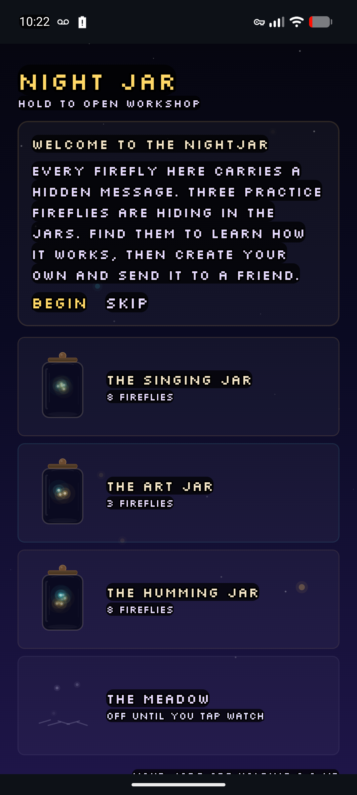
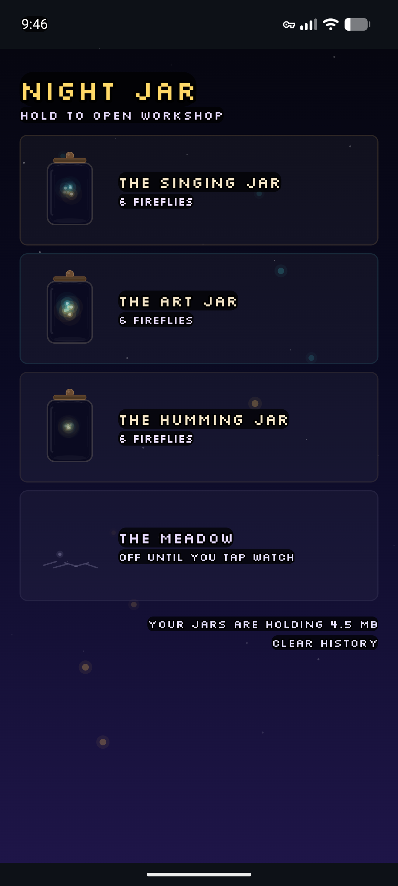
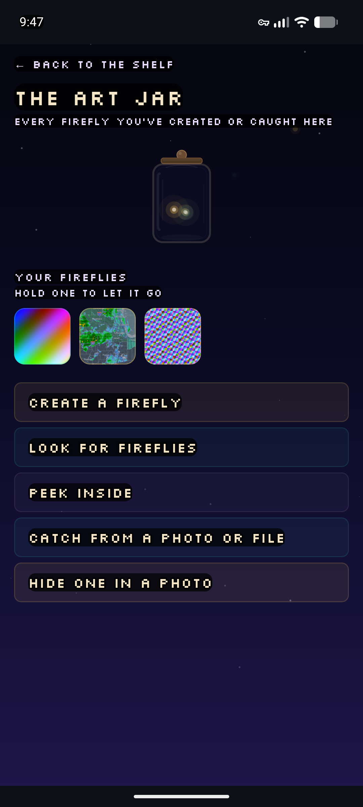
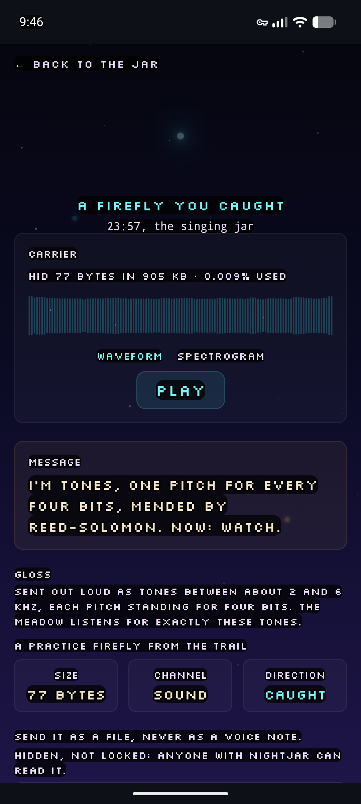
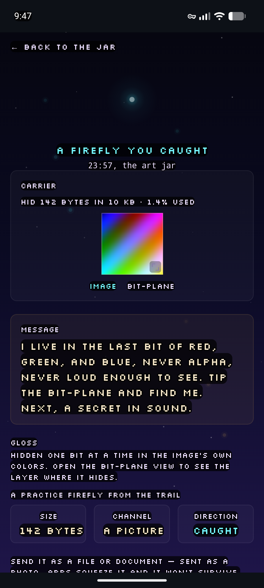
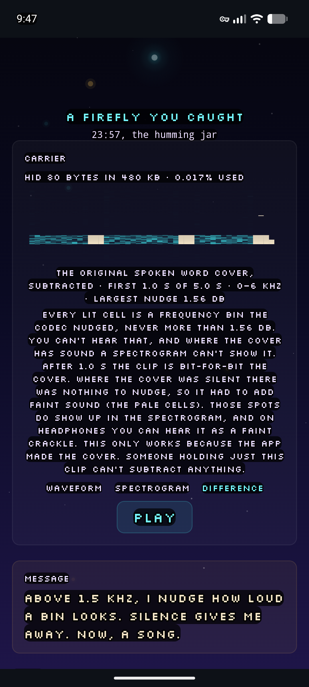
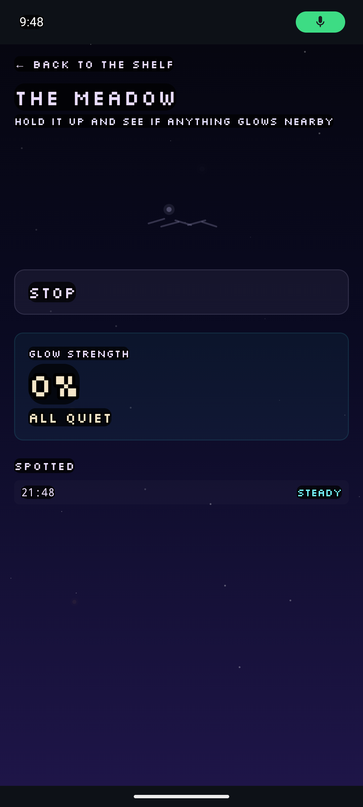
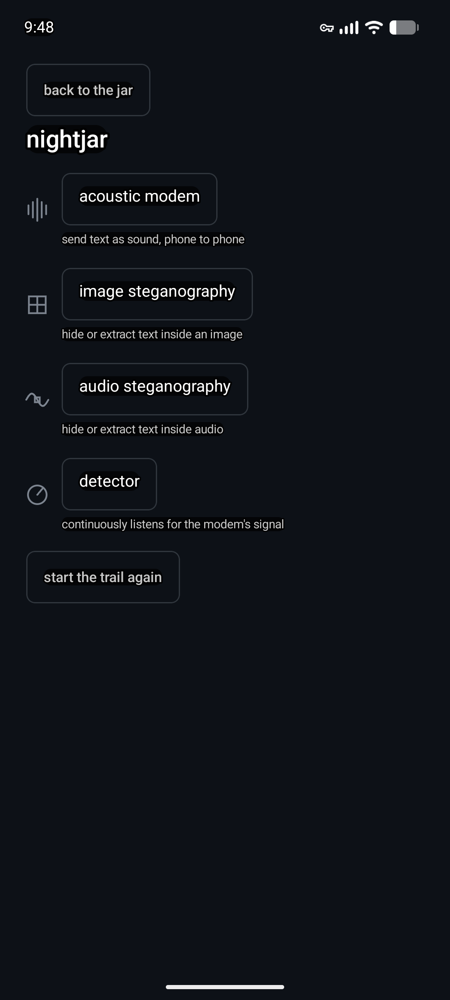
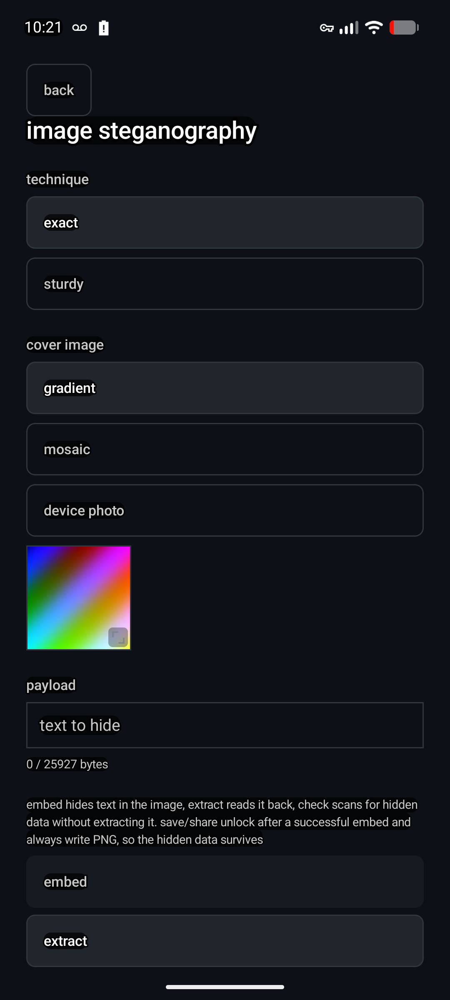

# nightjar

[](https://github.com/herakles-dev/nightjar/actions/workflows/ci.yml)
[](https://github.com/herakles-dev/nightjar/actions/workflows/codeql.yml)
[](https://securityscorecards.dev/viewer/?uri=github.com/herakles-dev/nightjar)
[](LICENSE)

An offline Android app that demonstrates covert data transmission — hiding
data in sound and images — alongside the detection techniques that can catch
it.

## What it does

nightjar pairs four data-hiding techniques with their detection/steganalysis
counterparts, all running locally on-device:

- **Acoustic data-over-sound modem** — sends data phone-to-phone, speaker to
  microphone, room-local, using FSK/PSK/MFSK encoding.
- **Image steganography** — least-significant-bit (LSB) encoding of data
  inside images, plus a steganalysis screen for detecting it.
- **Audio steganography** — four techniques (phase inversion, spectrogram-LSB,
  MFSK, and true phase-coding) for hiding data inside an audio clip.
- **Passive acoustic detector** — a real-time listener that can flag the
  modem's own signal, demonstrating that "covert" acoustic channels aren't
  necessarily undetectable.

The default UI is "Night Jar," a disguise-themed front end where every
decoded payload appears as a firefly. The underlying technical module screens
(modem, image stego, audio stego, detector) are reachable via a long-press
reveal gesture from the jar screen.

## Screenshots

Real screenshots from a Pixel 6a. The app opens as **Night Jar** — a calm,
disguise-themed front end where every hidden payload shows up as a "firefly."
A long-press on the jar reveals the technical **Workshop** underneath.

<table>
  <tr>
    <td align="center" valign="top" width="33%">
      <br>
      <sub><b>Welcome</b><br>first-run trail</sub>
    </td>
    <td align="center" valign="top" width="33%">
      <br>
      <sub><b>Night Jar</b><br>the home shelf</sub>
    </td>
    <td align="center" valign="top" width="33%">
      <br>
      <sub><b>Inside a jar</b><br>your fireflies</sub>
    </td>
  </tr>
  <tr>
    <td align="center" valign="top" width="33%">
      <br>
      <sub><b>In sound</b><br>acoustic modem</sub>
    </td>
    <td align="center" valign="top" width="33%">
      <br>
      <sub><b>In an image</b><br>LSB bit-plane</sub>
    </td>
    <td align="center" valign="top" width="33%">
      <br>
      <sub><b>In audio</b><br>spectrogram diff</sub>
    </td>
  </tr>
  <tr>
    <td align="center" valign="top" width="33%">
      <br>
      <sub><b>The Meadow</b><br>passive detector</sub>
    </td>
    <td align="center" valign="top" width="33%">
      <br>
      <sub><b>The Workshop</b><br>module menu</sub>
    </td>
    <td align="center" valign="top" width="33%">
      <br>
      <sub><b>Image tool</b><br>embed · extract</sub>
    </td>
  </tr>
</table>

## Download

Grab the latest signed APK from the [Releases page](https://github.com/herakles-dev/nightjar/releases/latest)
and install it directly — no Play Store needed. On your phone: download the
`.apk`, open it, and allow "install unknown apps" for your browser or file
manager if prompted.

Prefer to track updates automatically? [Obtainium](https://github.com/ImranR98/Obtainium)
can watch this GitHub repo and notify you of new releases — add
`herakles-dev/nightjar` as a GitHub source.

## Requirements

- Android 12+ (minSdk 31), target/compileSdk 35
- A single permission: `RECORD_AUDIO` (used by the acoustic modem and
  detector to capture microphone input)
- Android SDK + JDK 17 to build

## Build & run

```bash
./gradlew assembleDebug   # build debug APK (output: app-debug.apk)
./gradlew test            # run the JVM unit test suite
```

## Testing & quality

636 JVM unit tests cover the signal-processing core: the acoustic modem and
detector, image and audio steganography round-trips, Reed–Solomon error
correction, the LSB bit-plane and steganalysis capacity sweeps (including a
false-flag check against real photographs), and the incoming-payload pipeline.
CI runs Android lint, the test suite with coverage, and a debug build on every
push and pull request, and CodeQL and OpenSSF Scorecard run alongside it.

| Check | Result |
|---|---|
| Android lint | 0 errors (CI-enforced) |
| Line coverage, signal-processing core | 85.6% (2,654 lines) |
| Line coverage, whole app | 33.2% — the Compose UI screens are not unit-tested |
| Mutation score, modem / Reed–Solomon / FFT / spectrogram / detector | 89.8% (574 of 639 mutants killed) |

Coverage says a line ran; mutation testing ([PIT](https://pitest.org)) says a
test would notice if the line were wrong. Running it exposed a weaker spot in
the acoustic detector (69.5% killed) that new exact-output tests lifted to
85.3%. To reproduce:

```bash
./gradlew lintDebug jacocoTestReport   # lint + coverage: app/build/reports/
./gradlew pitest                       # mutation tests, ~15 min: app/build/reports/pitest/
```

Mutation testing also runs weekly in CI. Scope is the JVM-only core;
Robolectric and Compose code is too slow to mutate meaningfully.

## Architecture

Kotlin + Jetpack Compose + Room, built with AGP 8.7.3 / Kotlin 2.0.21. Each
technique lives behind a shared `CovertModule` interface, with its
transmit/embed logic in a `*Carrier` class and its detection logic in a
matching `*Detector`/`*Steganalysis` class:

```
modules/fireflyjar   Default disguise-themed UI (jar shelf, firefly log, player)
modules/acoustic      Acoustic FSK/PSK modem screen
modules/audiostego     Audio steganography screen (embed/extract)
modules/imagestego    Image LSB steganography screen
modules/detector       Passive acoustic detector screen
picker                Technical module-picker home screen
trail                 Onboarding "riddle trail" walkthrough
share                 Outbound sharing (FileProvider-based)
incoming              Unified incoming-payload pipeline: sniff, route, decode
```

Root-level classes (`AcousticCarrier`, `AudioStegoCarrier`, `ImageStegoCarrier`,
`SturdyImageCarrier`, `AcousticDetector`, `AudioStegDetector`,
`ImageSteganalysis`, `Fft`, `Spectrogram`, `WavFile`, `MicCapture`, …)
implement the signal-processing and steganalysis logic that the module
screens share.

## Intended use

nightjar is a **research and educational demonstration** of steganography and
covert-channel techniques, and of the detection methods used against them. It
is meant for learning, teaching, and experimentation in controlled settings —
not for evading lawful monitoring or transmitting data without the consent of
everyone involved. Please use it responsibly and lawfully.

## Credits & Acknowledgments

nightjar's techniques are directly inspired by, and in some cases adapt, the
published work of others — most notably **Benn Jordan**'s acoustic
data-hiding projects (Wavest, BUM16, AlphaSteg) and **Georgi Gerganov**'s
[ggwave](https://github.com/ggerganov/ggwave), along with foundational
steganography and audio-watermarking research. See [CREDITS.md](CREDITS.md)
for full acknowledgments.

## License

MIT — see [LICENSE](LICENSE). Third-party components (ggwave, the Silkscreen
font) are used under their own licenses; see [NOTICE](NOTICE) for details.

## Contributing

Issues and pull requests are welcome.
